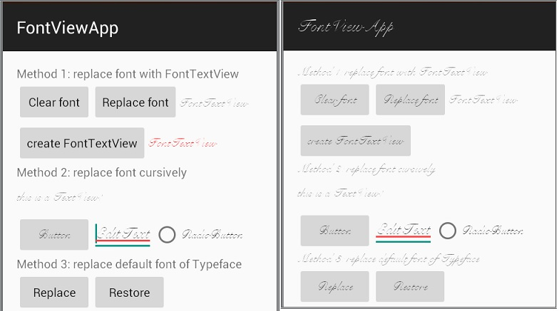

### FontTextView

This library include a custom view `FontTextView` and a Util class `FontUtils`.You can replace font with `FontTextView` in layout file, or use interface provided by `FontUtils` class in java code.

### Integration（集成）

Add code below to your build.gradle:

    repositories {
        // ...
        maven { url "https://jitpack.io" }
    }

    dependencies {
        ...
        compile 'com.whinc.widget.fontview:fontview:0.1.0'
    }

### How to use （如何使用）

#### Way 1

Use `FontTextView` in xml layout file:

    <com.whinc.widget.fontview.FontTextView
        android:layout_width="wrap_content"
        android:layout_height="wrap_content"
        android:text="@string/hello_world"
        app:font_path="fonts/my_font.ttf"
        />

Use `FontTextView` in java code:

    FontTextView fontTextView = new FontTextView(this);
    fontTextView.setPath("fonts/my_font.ttf");
    fontTextView.setText("Hello world!");

#### Way 2

Use `FontUtils` to replace default font of specified view and it's children:

    View root = findViewById(R.id.layout2);
    FontUtils.getInstance().replaceFont(root, "fonts/my_font.ttf");

#### Way 3

This method will replace system default font which will affect all widget.

    FontUtils.getInstance().replaceSystemDefaultFont(context, "fonts/my_font.ttf");

### The MIT License (MIT)

Copyright (c) 2015 WuHui

Permission is hereby granted, free of charge, to any person obtaining a copy
of this software and associated documentation files (the "Software"), to deal
in the Software without restriction, including without limitation the rights
to use, copy, modify, merge, publish, distribute, sublicense, and/or sell
copies of the Software, and to permit persons to whom the Software is
furnished to do so, subject to the following conditions:

The above copyright notice and this permission notice shall be included in all
copies or substantial portions of the Software.

[1]:https://bintray.com/whinc/maven/fontview/view
